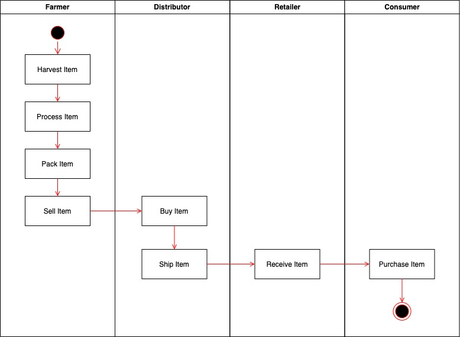

# Documentation

## Contracts

SupplyChain contract deployed on rinkeby, details on [etherscan](https://rinkeby.etherscan.io/address/0x0994a97788630FB70ed46a1a43afBAA060F4473e)

SupplyChain contract

    Transaction ID      0xa67fbeafc7dbd66c675de3f922e91b460427c2b047d9473303a0ddfb9d817494  
    Contract address    0x0994a97788630FB70ed46a1a43afBAA060F4473e

FarmerRole contract

    Transaction ID      0x789e60af998cdc0045a8ff1726ceb0b931eb5776c297b2c09109530b8c4c37a2
    Contract address    0x49dd7c79D9A53a7Ac72FacA85bA78Dc2decc7Dc9

DistributorRole contract

    Transaction ID      0x5669a54840bbd4d493b6f24ce5e97fd997fcabdb5775b23a2785c802dfc80d07
    Contract address    0x94483098E090494e1B4c7528b8a4d3C411e8D639

RetailerRole contract

    Transaction ID      0x6b49f2309a38686d40fb4f1808e18d324583da18d67d0896aea37153369d7715
    Contract address    0xFd9f29Ff00E6F84Ba9f13919B7d74f3976e1abD3

ConsumerRole contract

    Transaction ID      0x9c30fe99a174948cb1334a8ac97f742f6e917b41ed029c168ba363d82b873e38
    Contract address    0xB5ee4d0e2b23514cb067174f6E79B67Fb71ea820

## Website

[Website](https://ipfs.io/ipfs/QmZjgiJhD2BAHXSyoMsDybKJ2bwLHsJZ7iJYAAK1dDGvDG/) deployed on IPFS

Distribute info:

    1. Copy app/src dir & build/contracts/SupplyChain.json into a directory, ie: `distribution` dir
    2. Upload the directory to your ipfs provider

## Specs

* truffle-assertions: used to test events emitted by contracts
* web3: used in the frontend to be able to interact with ethereum network
* truffleContract: used in the frontend to be able to load the contract interface(from its JSON representation) to interact with the deployed backend. I had some issues with embedded truffleContract
* pinata cloud(IPFS): used to host the frontend to help reviewer using the dapp. hosted on [pinata cloud](https://www.pinata.cloud/)

## Program version numbers

* Truffle v5.4.17 (core: 5.4.17)
* Solidity ^0.8.10 (solc-js)
* Node v12.22.6
* Web3.js v1.5.3

## Diagrams

Activity

Sequence

State

Class

